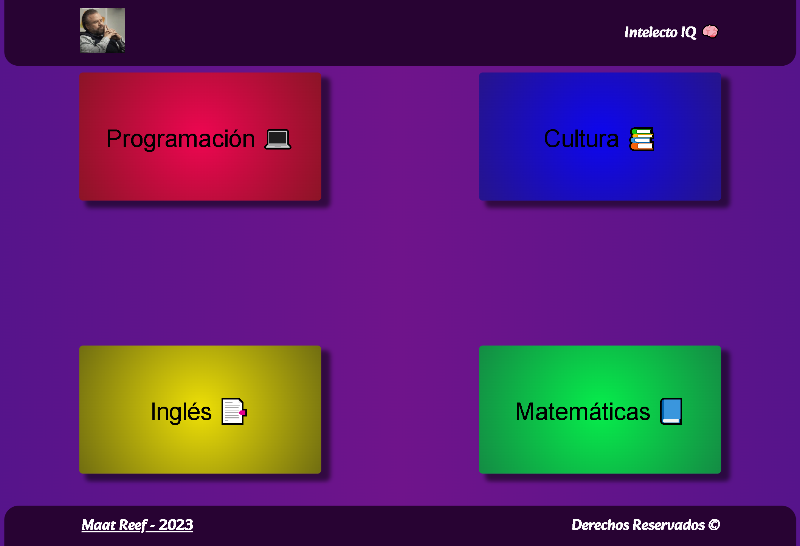
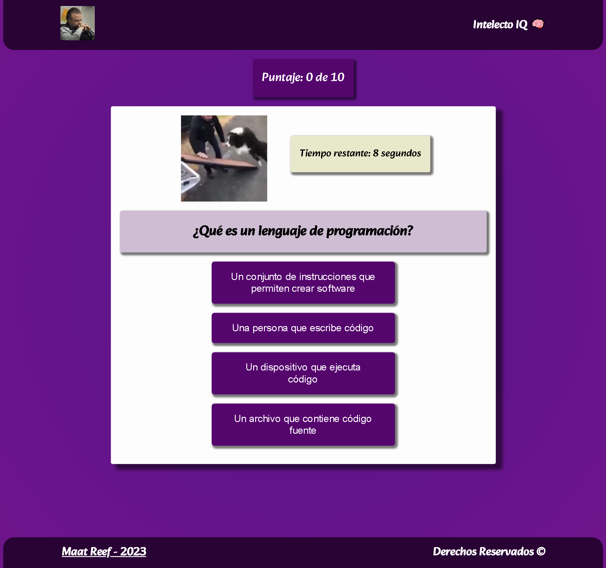

# Quizz MultipleChoice -IQ Intelect 🧠
[Ver Proyecto IQ Intelect](https://maatreef.github.io/quiz-multiplechoice/ "Ver Proyecto")

## Tecnologías Utilizadas:

- Javascript (Fetch Api)
- Objetos Json
- Manejo del Dom
- Css Puro

---
## Descripción 📘 

Proyecto conciso y divertido, preguntas y respuestas en diferentes tópicos. La aplicación cuenta con 10 preguntas totales por categoría (Total de 40 preguntas), en las cuales incluyo las siguientes categorías, programación, cultura, inglés y matemáticas.

---
## Vista Principal ✔
---

---
## Vista Detalle 📑
---

## Vista Mobile 📑
---

